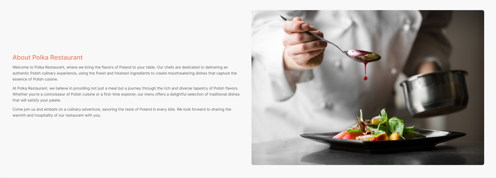

# Polka Restaurant

## Features

Web application has the following pages:
- home page
- menu page
- information page
- login page
- signup page
- reset password page
- book a table page
- your reservations page
- edit your reservation page
- cancel your reservation page

### Access to pages according to the user role:

| Page Name                   | Customer | Admin   |
| --------------------------- | -------- | ------- |
| home page                   | Y        | Y       |
| menu page                   | Y        | Y       |
| information page            | Y        | Y       |
| login page                  | Y        | Y       |
| signup page                 | Y        | Y       |
| reset password page         | Y        | Y       |
| book a table page           | Y        | Y       |
| your reservations page      | Y        | Y       |
| edit your reservation page  | Y        | Y       |
| cancel your reservation page| Y        | Y       |

- Each page has a navbar and a footer

**Navbar**

Navbar has the following links:
- home page
- 
- menu page
- 
- information page
- 
- login page
- 

The simplistic design of the navbar is based on the decision to make the use of the webapp easy for the user.

When the user is logged in, the navbar looks as follows.

- 

It has an additional Book a Table page
- book a table
- 

When the user is logged in and has existing reservations, the navbar looks as follows.

- 

It has an additional Your Reservations page
- your reservations
- 

**Footer**

Footer has the following sections:

- Opening Hours:
- 

- Contact Us:
- 

- Find us:
- 

- Made by:
- 

For the mobile version of the website, the footer looks as follows:

  

**Home page**

The Home page has a simple welcome message and a button "Log in to Book a Table" which leads to the login page. However, if the user is logged in the Home Page looks as follows:

- 

Under the hero section, there is a section, which describes the restaurant.

- 

Under the restaurant description section, there is aa section with opening hours.

- 

**Menu page**

  

The "Menu" section allows users to easily browse through categorized dishes.

**Information page**
  