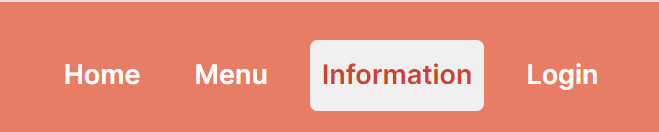
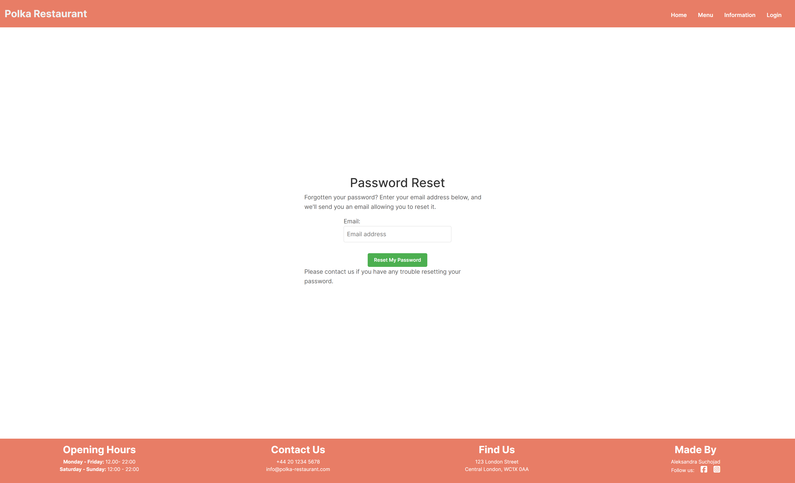
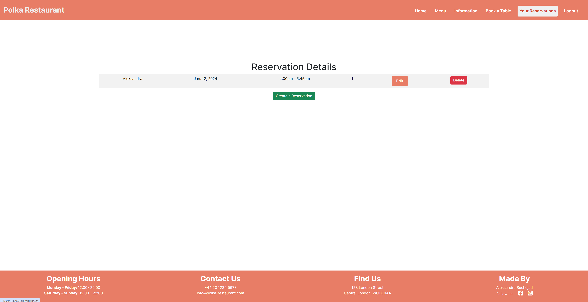

# Polka Restaurant

## Features

Web application has the following pages:
- home page
- menu page
- information page
- login page
- signup page
- reset password page
- book a table page
- your reservations page
- edit your reservation page
- cancel your reservation page

### Access to pages according to the user role:

| Page Name                   | Customer | Admin   |
| --------------------------- | -------- | ------- |
| home page                   | Y        | Y       |
| menu page                   | Y        | Y       |
| information page            | Y        | Y       |
| login page                  | Y        | Y       |
| signup page                 | Y        | Y       |
| reset password page         | Y        | Y       |
| book a table page           | Y        | Y       |
| your reservations page      | Y        | Y       |
| edit your reservation page  | Y        | Y       |
| cancel your reservation page| Y        | Y       |

- Each page has a navbar and a footer

**Navbar**

Navbar has the following links:
- home page
- 
- menu page
- 
- information page
- 
- login page
- 

The simplistic design of the navbar is based on the decision to make the use of the webapp easy for the user.

When the user is logged in, the navbar looks as follows.

- 

It has an additional Book a Table page
- book a table
- 

When the user is logged in and has existing reservations, the navbar looks as follows.

- 

It has an additional Your Reservations page
- your reservations
- 

**Footer**

Footer has the following sections:

- Opening Hours:
- 

- Contact Us:
- 

- Find us:
- 

- Made by:
- 

For the mobile version of the website, the footer looks as follows:

  

**Home page**

The Home page has a simple welcome message and a button "Log in to Book a Table" which leads to the login page. However, if the user is logged in the Home Page looks as follows:

- 

Under the hero section, there is a section, which describes the restaurant.

- 

Under the restaurant description section, there is aa section with opening hours.

- 

**Menu page**

  

The "Menu" section allows users to easily browse through categorized dishes.

**Information page**
  

The Information page contains the story of the restaurant and opening hours section. 

**Login page**

  

Login Page has a container with a login form, which has a header and input fields for the user to fill in. Plus it has a button "Sign In" and "Forgot password?", leading to the forgot password page.

 

The header has the title "Log in" and the subtitle "If you have not created an account yet, then please sign up first."

When the user clicks on the button, he is redirected to the registration page.

Underneath, there are two fields which have to be filled out in order to log in:

- Username
- Password

  

Under the fields, there is a button "Sign in" which leads to the schedule page.

  

**Logout page**

  

This page has a logout form with a header and a button "Sign Out" leading to the home page.

  

It has the title "Sign out" and the subtitle "Are you sure you want to aign out?"
Underneath, there is a button "Sign Out".

  

**Forgot password page**

  

 It has a reset password form with a header and input fields for the user to fill in and a reset button.

 

The header has the title "Password Reset" and a subtitle, which guides the user on what actions should be done in order to regain access to the user's account.

  

Underneath, there are fields, where the user can type in his email address.

If the user types a wrong email address, the email field will be highlighted.

There is a button "Reset My Password," which leads to the home page. The user will receive an email with a link to reset his password.

  
  
**Signup page**

  

Signup Page has a signup form, which has a header and input fields for the user to fill in. Plus it has a button "Sign up".

**Book a table page**
  

Every user that is authenticated can access the *Reservation* page for making a reservation. This feature provides a form where the user can fill in the reservation details.
* The form is for selecting the date and time interval of the booking.
    The inputs are validated after the following rules:
    * The Date value should not be less than the current day; 
    * Entering Name, date and number of people is required; 
    * Maximum number of guests for a reservation is 8 people; 
    * The user can choose times from a list;
      * 1: 12:00 - 12:45
      * 2: 14:00 - 15:45
      * 3: 16:00 - 17:45
      * 4: 18:00 - 19:45
      * 5: 20:00 - 21:45

**Your Reservations page**
  

  Every client that is authenticated can access the *Reservation* page where they have an overview over their reservations.
* From this view they can select to:
    * Create a new reservation; 
    * Edit an existing reservation; 
    * Delete a reservation; 