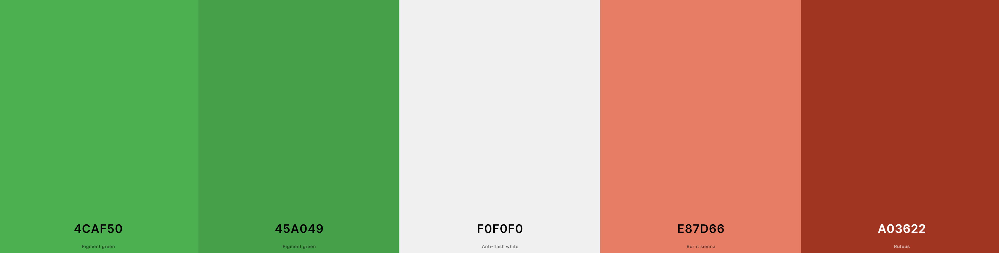
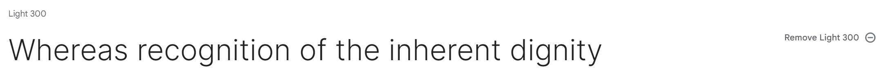
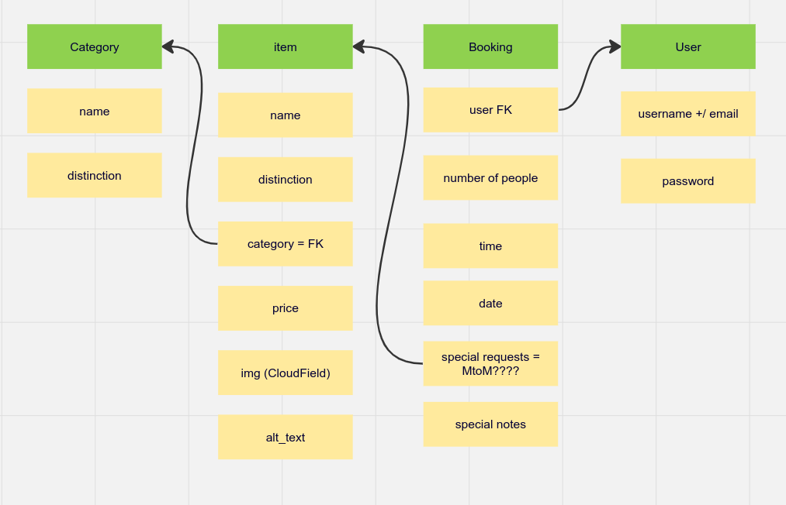

# Polka Restaurant

Live Version: [Polka Restaurant](#)

Repository: [GitHub Repo](https://github.com/aleksandrasucho/polish-restaurant)

The app is developed by [Aleksandra Suchojad](https://github.com/aleksandrasucho).

## About

[Polka Restaurant](#) is a web application presenting authentic Polish cuisine with a user-friendly reservation system. The application allows customers to easily reserve tables, add special notes for their bookings, and specify the number of guests. The system ensures that only available tables are offered to the customers, considering variables like time, date, and capacity. The application was built using Python (Django), HTML, CSS, and JavaScript, with data being stored in a PostgreSQL database and images on a Cloudinary account.

## User Experience Design

### Strategy

Built specifically for Polka Restaurant, this web application boasts a user-friendly design aimed at simplifying day-to-day operations. From managing reservations to showcasing the vibrant menu, the app ensures an easy and intuitive experience. The ultimate goal is to streamline restaurant management, making it more efficient and enhancing the overall dining experience for both staff and customers. Welcome to Polka Restaurant, where technology meets taste for a smoother and more enjoyable culinary journey.

### User Stories

#### **First Time Visitor Goals**

| Issue ID    | User Story |
|-------------|-------------|
|[#1](https://github.com/aleksandrasucho/polish-restaurant/issues/1)| As a First Time Visitor, I want to be able to easily understand the main purpose of the app, so that I can learn more about this app. |
|[#2](https://github.com/aleksandrasucho/polish-restaurant/issues/2)|As a First Time Visitor, I want to be able to easily navigate through the app, so that I can find the content.|
|[#3](https://github.com/aleksandrasucho/polish-restaurant/issues/3)|As a First Time Visitor, I want to be able to register my account, so that I can manage my reservations.|
|[#14](https://github.com/aleksandrasucho/polish-restaurant/issues/14)|As a First Time Visitor, I want to be able to see contact information on the website so that I can call or email in case I have any inquiries.|
|[#17](https://github.com/aleksandrasucho/polish-restaurant/issues/17)|As a First Time Visitor, I want to be able to see contact information on the website so that I can call or email in case I have any inquiries.|
|[#13](https://github.com/aleksandrasucho/polish-restaurant/issues/13)|As a First Time Visitor, I want to be able to see the opening and closing hours so that I can plan my dinner visit.|
|[#10](https://github.com/aleksandrasucho/polish-restaurant/issues/10)|As a First Time Visitor, I can select a time and date to finalize my reservation.|

#### **Frequent Visitor Goals**

| Issue ID    | User Story |
|-------------|-------------|
|[#4](https://github.com/aleksandrasucho/polish-restaurant/issues/4)|As a Frequent User, I want to be able to log in to my account, so that I can have a personal account.|
|[#5](https://github.com/aleksandrasucho/polish-restaurant/issues/5)|As a Frequent User, I want to be able to log out of my account, so that I keep my account secure.|
|[#6](https://github.com/aleksandrasucho/polish-restaurant/issues/6)|As a Frequent User, I want to be able to easily log in and log out, so that I can access my personal account information.|
|[#7](https://github.com/aleksandrasucho/polish-restaurant/issues/7)|As a Frequent User, I can reset my password by sending a link so that I can log in even if I forget my password.|
|[#8](https://github.com/aleksandrasucho/polish-restaurant/issues/8)|As a Frequent User, I can find relevant information about the restaurant so that I can plan my visit more easily|
|[#9](https://github.com/aleksandrasucho/polish-restaurant/issues/9)|As a Frequent User, I can see available tables for a specific date and time so that I can easier decide where to sit.|

#### **Logged-in User**
| Issue ID    | User Story |
|-------------|-------------|
|[#11](https://github.com/aleksandrasucho/polish-restaurant/issues/11)|As a logged-in user, I can see my reservations list for a better overview.|
|[#12](https://github.com/aleksandrasucho/polish-restaurant/issues/12)|As a logged-in user, I can cancel reservations so that I have control over my bookings|
|[#15](https://github.com/aleksandrasucho/polish-restaurant/issues/15)|As a logged in user, I want to be able to update my reservation in case of any changes.|

---

## Technologies used

- ### Languages:
    
    + [Python 3.8.5](https://www.python.org/downloads/release/python-385/): the primary language used to develop the server-side of the website.
    + [JS](https://www.javascript.com/): the primary language used to develop interactive components of the website.
    + [HTML](https://developer.mozilla.org/en-US/docs/Web/HTML): the markup language used to create the website.
    + [CSS](https://developer.mozilla.org/en-US/docs/Web/css): the styling language used to style the website.

- ### Frameworks and libraries:

    + [Django](https://www.djangoproject.com/): python framework used to create all the logic.
    + [jQuery](https://jquery.com/): was used to control click events and sending AJAX requests.
    + [jQuery User Interface](https://jqueryui.com/) was used to create interactive elements.

- ### Databases:

    + [SQLite](https://www.sqlite.org/): was used as a development database.
    + [PostgreSQL](https://www.postgresql.org/): the database used to store all the data.

- ### Other tools:

    + [Git](https://git-scm.com/): the version control system used to manage the code.
    + [Pip3](https://pypi.org/project/pip/): the package manager used to install the dependencies.
    + [Gunicorn](https://gunicorn.org/): the webserver used to run the website.
    + [Spycopg2](https://www.python.org/dev/peps/pep-0249/): the database driver used to connect to the database.
    + [Django-allauth](https://django-allauth.readthedocs.io/en/latest/): the authentication library used to create the user accounts.
    + [Django-crispy-forms](https://django-cryptography.readthedocs.io/en/latest/): was used to control the rendering behavior of Django forms.
    + [Render](https://render.com/): the cloud platform used to host the website.
    + [ElephantSQL](https://www.elephantsql.com/): the cloud database used to store all the data.
    + [GitHub](https://github.com/): used to host the website's source code.
    + [VSCode](https://code.visualstudio.com/): the IDE used to develop the website.
    + [Chrome DevTools](https://developer.chrome.com/docs/devtools/open/): was used to debug the website.
    + [Font Awesome](https://fontawesome.com/): was used to create the icons used in the website.
    + [Draw.io](https://www.lucidchart.com/) was used to make a flowchart for the README file.
    + [Coolors](https://coolors.co/202a3c-1c2431-181f2a-0b1523-65e2d9-925cef-6b28e0-ffffff-eeeeee) was used to make a color palette for the website.
    + [Cloudinary](https://cloudinary.com/): was used  for storing static data.
    + [W3C Validator](https://validator.w3.org/): was used to validate HTML5 code for the website.
    + [W3C CSS validator](https://jigsaw.w3.org/css-validator/): was used to validate CSS code for the website.
    + [JShint](https://jshint.com/): was used to validate JS code for the website.
    + [PEP8](https://pep8.org/): was used to validate Python code for the website.

---

## FEATURES

Please refer to the [FEATURES.md](FEATURES.md) file for all features-related documentation.

---

## Design

The design of the application is based on the Material Design principles.
The central theme of the application is the simplicity of use. Thus, all the components are designed to be easy to use. The minimalistic approach was used to create something meaningful without moving out of focus.
### Color Scheme

  

  
The website features a modern color scheme:

 - Hero Section: Dark background with a subtle overlay (rgba(0, 0, 0, 0.5)).

- Primary Button: Vibrant green (#4CAF50) with a darker hover effect (#45a049).

- Navbar: Energetic background color (#e87d66) with contrasting white text.

- About Section: Clean light background (#f8f8f8) with an accent color (#e87d66).

- Opening Hours Section: Professional appearance with a white background and dark text (#333).

- Sign-In Page: Organized interface with light background (#f8f8f8) and green accents.

- Menu Section: Energetic orange accent color (#e87d66) for headings and buttons.

- Information Container: Consistent design with light background (#f8f8f8) and accent color (#e87d66).

- Card Styling: Modern appearance with a subtle box shadow (rgba(0, 0, 0, 0.1)) and light border (#ddd).

- Footer: Bold and vibrant background color (#e87d66) for a strong visual anchor.

- Delete Reservation and Password Reset Sections: Cohesive design with accent color (#e87d66) for buttons and hover effects.

In summary, the color scheme combines warmth, vibrancy, and professionalism, creating a visually appealing and user-friendly website.

### Typography

The website pays careful attention to typography for a harmonious and readable user experience. Utilizes the "Inter" sans-serif font for a clean and modern look.

### Wireframes

- [Desktop Wireframes](documentation/wireframes/)

---

## Flowcharts

The following flowcharts were created to help to understand the application and its functionality.

The flowcharts were created using [Draw.io](https://www.lucidchart.com/).

---

## Information Architecture

### Database

* During the earliest stages of the project, the database was created using SQLite.
* The database was then migrated to PostgreSQL.

### Entity-Relationship Diagram

* The ERD was created using [Draw.io](https://www.lucidchart.com/).

- [Database Scheme](documentation/diagrams/db_final.png)

---
## Testing

Please refer to the [TESTING.md](TESTING.md) file for all test-related documentation.

---

## Deployment

- The app was deployed to [Heroku](https://www.heroku.com/).
- The database was deployed to [ElephantSQL](https://www.elephantsql.com/).

- The app can be reached by the [link](#).

Please refer to the [DEPLOYMENT.md](DEPLOYMENT.md) file for all deployment-related documentation.

---

## Credits

- [GitHub](https://github.com/) for giving the idea of the project's design.
- [Django](https://www.djangoproject.com/) for the framework.
- [ElephantSQL](https://www.elephantsql.com/): for the free hosting of the database.
- [Font awesome](https://fontawesome.com/): for the free access to icons.
- [Heroku](https://www.heroku.com/): for the free hosting of the website.
- [jQuery](https://jquery.com/): for providing varieties of tools to make standard HTML code look appealing.
- [Coolors](https://coolors.co/): for providing a free platform to generate your own palette.
- [Icons8](https://icons8.com/): for providing free access to amazing icons and illustrations.
- [Postgresql](https://www.postgresql.org/): for providing a free database.
- [Codemy.com](https://www.youtube.com/watch?v=N-PB-HMFmdo): for providing a free video on how to implement pagination in the project.
- [Responsive Viewer](https://chrome.google.com/webstore/detail/responsive-viewer/inmopeiepgfljkpkidclfgbgbmfcennb/related?hl=en): for providing a free platform to test website responsiveness
- [GoFullPage](chrome://extensions/?id=fdpohaocaechififmbbbbbknoalclacl): for allowing to create free full web page screenshots;
- [Favicon Generator. For real.](https://realfavicongenerator.net/): for providing a free platform to generate favicons.

---

## Acknowledgments

- [Juliia Konovalova ](https://github.com/IuliiaKonovalova) was a great supporter. She guided me through the development of the project and helped me to learn a lot of new things by challenging me to do something new.
- [Code Institute](https://codeinstitute.net/) tutors and Slack community members for their support and help.