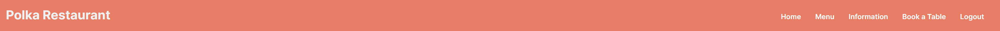
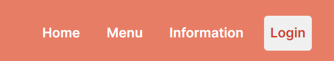
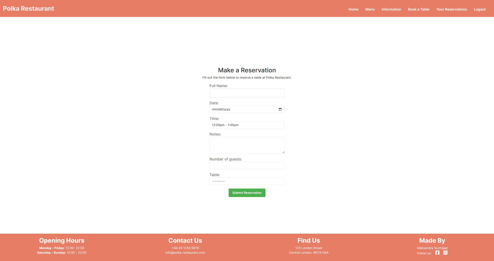
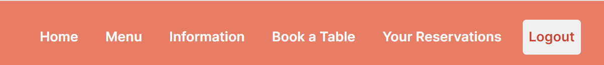
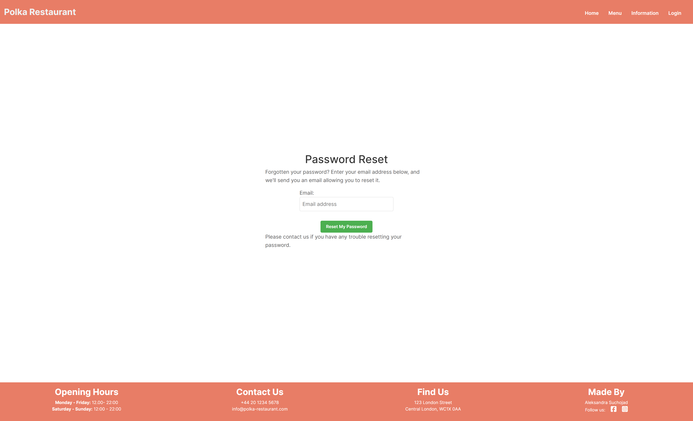
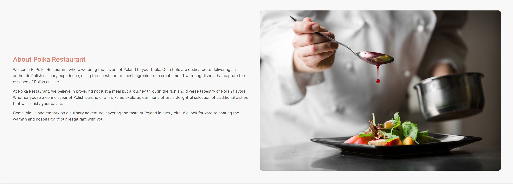
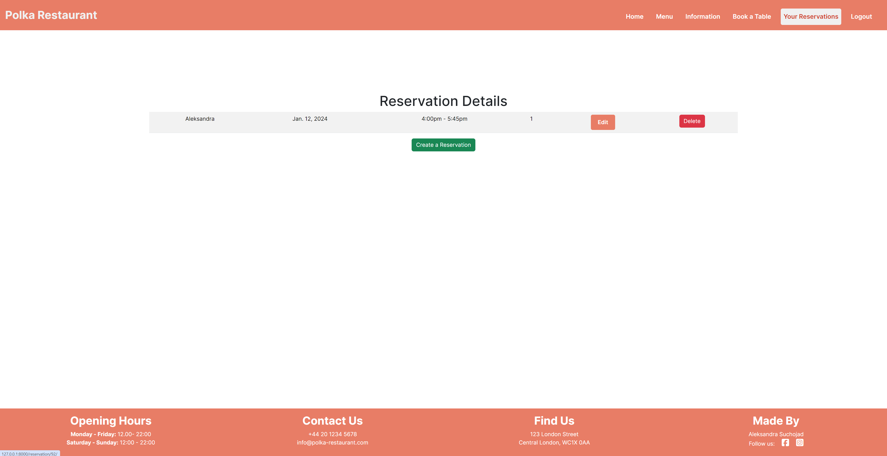
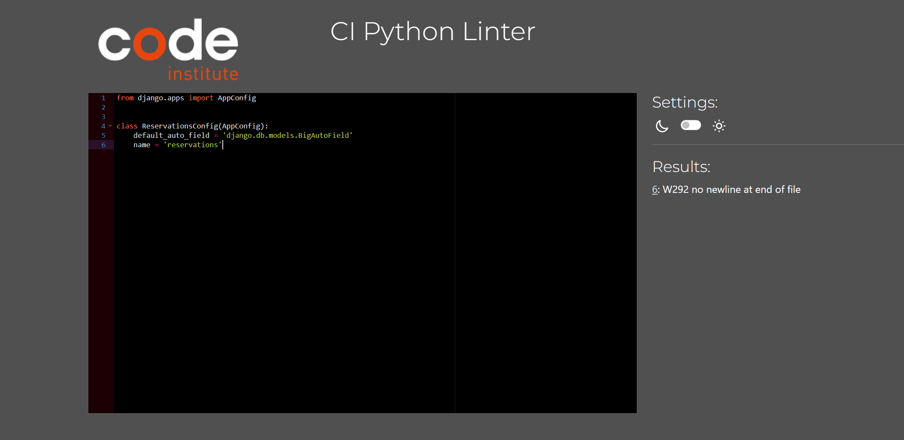
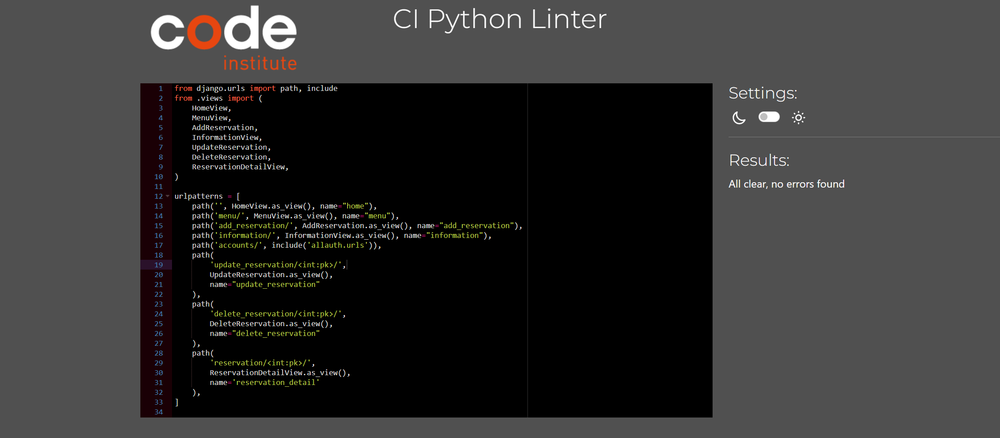

# Testing

## Manual Testing

Testing was done throughout site development, for each feature before it was merged into the master file.

Usability was tested with the below user acceptance testing, sent to new users to ensure testing from different users, on different devices and browsers to ensure issues were caught and where possible fixed during development.

|     | User Actions           | Expected Results | Y/N | Comments    |
|-------------|------------------------|------------------|------|-------------|
| Sign Up     | 
| 1           | Click on Sign Up button | Redirection to Sign Up page | Y |          |
| 2           | Click on the Login link in the form | Redirection to Login page | Y |          |
| 3           | Enter valid email | Field will only accept email address format | Y |          |
| 4           | Enter valid username | Field will only accept no more than 50 characters | Y |          |
| 5           | Enter valid Full Name | Field will only accept no more than 30 characters | Y |          |
| 6          | Enter valid password | Field will only accept secure passwords | Y |          |
| 7          | Enter valid password confirmation | Field will only accept the same password from the previous field | Y |          |
| 8          | Click on the Sign Up button | Takes user to the home page as a logged in user | Y |          |           |
| 9          | Click "Logout" | Takes user to log out page to confirm logout | Y |          |
| 10          | Click "Logout" button  in the center of the page| Redirects user to home page | Y |          |
| Log In      |                        |                  |      |             |
| 1           | Click on Login button | Redirection to Login page | Y |          |
| 2           | Click on the SignUp link in the form | Redirection to SignUp page | Y |          |
| 3           | Enter valid email or username | Field will only accept email address format | Y |          |
| 4           | Enter valid password | Field will only accept secure passwords | Y |          |
| 5           | Click on the Sign In button | Takes user to schedule page with pop-up confirming successful sign in. Get started button now missing in main nav, replaced by Menu | Y |          |
| 6           | Clicks "Forgot Password" instead of "Sign In" | Redirects user to forgot password page | Y |          |
| 7           | Click "Logout" | Takes user to log out page to confirm logout | Y |          |
| 8           | Click "Logout" button  in the center of the page| Redirects user to home page | Y |          |
| Menu        |                        |                  |      |             |
| 1           | Click on the "Menu" button | Redirection to Menu Page |
| 2           | Click on "Home" | Redirection to Home Page | Y | Available to everyone |
| 3           | Click on "Information" | Redirection to Information page | Y | Available only to bosses and sales managers |
| 4           | Click on "Book a Table" | Redirection to Make a Reservation page| Y | Available only to logged in users |
| 5           | Click on "Your Reservations" | Redirection to Reservation Details page | Y | Available only to logged in users with existing reservations |
| 6           | Click on "Logout" button in the center of the page | Takes user to log out page to confirm logout | Y | Available to everyone |
| Home       |                        |                  |      |             |
| 1           | Click on "Book a Table" | Redirection to Make a Reservation page | Y | Available to logged in users |
| 2           | Click on "Log in to Book a Table" | Redirection to Login page | Y | Available to everyone |
| 3           | Click on the "Menu" button | Redirection to Menu Page |
| 4           | Click on "Home" | Redirection to Home Page | Y | Available to everyone |
| 5           | Click on "Information" | Redirection to Information page | Y | Available only to bosses and sales managers |
| 6           | Click on "Book a Table" | Redirection to Make a Reservation page| Y | Available only to logged in users |
| 7           | Click on "Your Reservations" | Redirection to Reservation Details page | Y | Available only to logged in users with existing reservations |
| 8           | Click on "Logout" button in the center of the page | Takes user to log out page to confirm logout | Y | Available to logged in users|
| Information      |                        |                  |      |             |
| 1           | Click on the "Menu" button | Redirection to Menu Page |
| 2           | Click on "Home" | Redirection to Home Page | Y | Available to everyone |
| 3           | Click on "Information" | Redirection to Information page | Y | Available only to bosses and sales managers |
| 4           | Click on "Book a Table" | Redirection to Make a Reservation page| Y | Available only to logged in users |
| 5           | Click on "Your Reservations" | Redirection to Reservation Details page | Y | Available only to logged in users with existing reservations |
| 6           | Click on "Logout" button in the center of the page | Takes user to log out page to confirm logout | Y | Available to logged in users|
| Book a Table       |                        |                  |      |             |
| 1           | Click on the "Menu" button | Redirection to Menu Page |
| 2           | Click on "Home" | Redirection to Home Page | Y | Available to everyone |
| 3           | Click on "Information" | Redirection to Information page | Y | Available only to bosses and sales managers |
| 4           | Click on "Book a Table" | Redirection to Make a Reservation page| Y | Available only to logged in users |
| 5           | Click on "Your Reservations" | Redirection to Reservation Details page | Y | Available only to logged in users with existing reservations |
| 6           | Click on "Submit Reservation" | Redirection to Reservation Details page | Y | Available only to logged in users|
| 7           | Click on "Logout" button in the center of the page | Takes user to log out page to confirm logout | Y | Available to logged in users|
| Your Reservations       |                        |                  |      |             |
| 1           | Click on the "Menu" button | Redirection to Menu Page |
| 2           | Click on "Home" | Redirection to Home Page | Y | Available to everyone |
| 3           | Click on "Information" | Redirection to Information page | Y | Available only to bosses and sales managers |
| 4           | Click on "Book a Table" | Redirection to Make a Reservation page| Y | Available only to logged in users |
| 5           | Click on "Your Reservations" | Redirection to Reservation Details page | Y | Available only to logged in users with existing reservations |
| 6           | Click on "Logout" button in the center of the page | Takes user to log out page to confirm logout | Y | Available to logged in users|
| 7           | Click on "Edit" | Takes user to update his reservation | Y | Available to logged in users|
| 8           | Click on "Cancel" | Takes user to ucancel his reservation | Y | Available to logged in users|
| Update Profile |            |                  |      |             |
| 1           |  Change the form data for the first name, last name, time or date | Date in the form will be updated | Y | Available only when the user is logged in and has a reservation created  |
| 2           |  Click "update" button | Redirect back to user profile+data will be updated in the database | Y | Available only when the user is logged in and has a reservation created |
|Delete Profile |            |                  |      |             |
| 2           |  Click "cancel" button | Redirect back to user profile | Y | Available only when the user is logged in and has a reservation created  |
| 3           |  Click "delete" button | Redirect to home page | Y | Available only when the user is logged in and has a reservation created  |
| Reset Password |            |                  |      |             |
|1                | Enter valid email | Field will only accept valid email address | Y |  Available to everyone |

---

## Testing User Story

| First Time Visitor Goals | Requirement met | Image |
| ------------------------- | --------------- | ----- |
| As a First Time Visitor, I want to be able to easily understand the main purpose of the app, so that I can learn more about this app. | Welcome text on the top of the homepage explaining the main purpose of the website |  |
| As a First Time Visitor, I want to be able to easily navigate through the app, so that I can find the content.| The navigation bar is clear and user-friendly, providing quick access to different sections of the app. |  |
| As a First Time Visitor, I want to be able to register my account, so that I can manage my reservations.| Top navigation Login + Log in button in the hero section |  |
| As a First Time Visitor, I want to be able to see contact information on the website so that I can call or email in case I have any inquiries.| All contact details are on every page in the footer section |  |
As a First Time Visitor, I want to be able to see the opening and closing hours so that I can plan my dinner visit.| The opening and closing hours are on every page in the footer section + at the bottom of home and information page |  |
|As a First Time Visitor, I can select a time and date to finalize my reservation.| Options in the Make a Reservation page | |

| Frequent Visitor Goals    | Requirement met | Image |
| ------------------------- | --------------- | ----- |
|As a Frequent User, I want to be able to log in to my account, so that I can have a personal account.| Log in from the top right navigation |  |
|As a Frequent User, I want to be able to log out of my account, so that I keep my account secure.| Logout from the top right navigation |  |
|As a Frequent User, I want to be able to easily log in and log out, so that I can access my personal account information. |Log in and out from the top right navigation |   |
|As a Frequent User, I can reset my password by sending a link so that I can log in even if I forget my password.| Available while logging in |  |
|As a Frequent User, I can find relevant information about the restaurant so that I can plan my visit more easily| About sectioan on the home page |   |
|As a Frequent User, I can see available tables for a specific date and time so that I can easier decide where to sit.| Available while creating a reservation |  |

| Logged-in User    | Requirement met | Image |
| ------------------------- | --------------- | ----- |
|As a logged-in user, I can see my reservations list for a better overview.| Available on Your Reservations page. |  |
|As a logged-in user, I can cancel reservations so that I have control over my bookings|Available on Your Reservations page. |  |
|As a logged in user, I want to be able to update my reservation in case of any changes.| Available on Your Reservations page. |  |

## Bugs

### Known bugs
When attempting to create an additional reservation while already in the "Your Reservations" section, the existing reservation is unintentionally deleted.

### Solved bugs

There were plenty of bugs during the development process since this project was a learning platform for me and allowed me to improve my skills and knowledge significantly.

1. Django Improperly Configured Error: I encountered the django.core.exceptions.ImproperlyConfigured: allauth.account.middleware.AccountMiddleware must be added to settings.MIDDLEWARE error.
- *Solutions:* The issue has been addressed by adding allauth.account.middleware.AccountMiddleware to the settings.MIDDLEWARE as per the Django configuration requirements.

2. gunicorn.errors.HaltServer: <HaltServer 'Worker failed to boot.' 3> django
- *Solutions:* The issue has been resolved by investigating and fixing the underlying cause, allowing the Gunicorn server to start successfully.

---

## Validation:
### HTML Validation:

- [Full HTML Validation Report](documentation/validation/html-validator.png)

- No errors or warnings were found when passing through the official [W3C](https://validator.w3.org/) validator.

### CSS Validation:

- [Full CSS Validation Report](documentation/validation

- No errors or warnings were found when passing through the official [W3C (Jigsaw)](https://jigsaw.w3.org/css-validator/#validate_by_uri) validator except for the warnings about the use of css root variables and webkits for the box-shadow. However, css code works perfectly on various devices.

### JS Validation:

No JavaScript has been employed in this project. 

### Python Validation:

- [Full Python Validation Report](documentation/validation/python_validation.pdf)

The python code was tested using [Coding Institutes Python Linter](https://pep8ci.herokuapp.com/).

**Pep8 results:** 

Reservation app

* **apps.py** 

* **urls.py** 

* **views.py** 

* **forms.py** 

* **models.py** 

* **test_forms.py** 

* **test_views.py** 

 